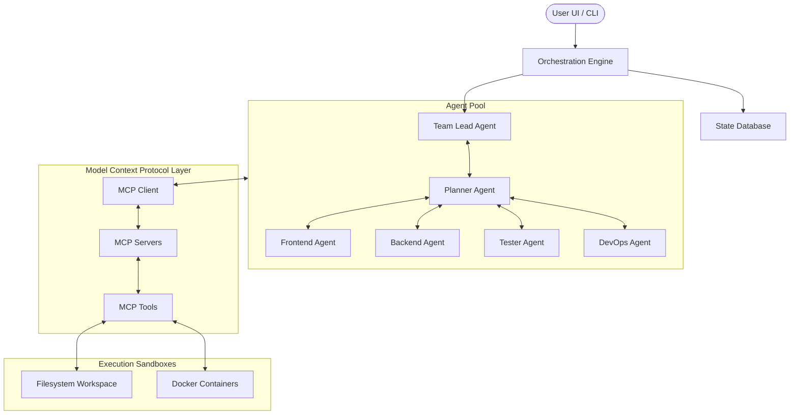

# Architecture Overview

AutoDev AI is designed as a modular, decoupled, multi-agent platform using the Model Context Protocol (MCP) as the foundational interface layer between agents, orchestrators, and system tools.

---

## 1. System Architecture

The following diagram represents the core architecture of the system:

---

## 2. Key Components

### 2.1 Front-End Layer
- Dynamic client dashboard built as a single-page application.
- Real-time logging viewer using WebSockets.
- Task status tracker and manual approval step modal dialogs.

### 2.2 Back-End / Orchestration Layer
- **Orchestrator Engine**: Coordinates state machines, schedules agent calls, and maintains context windows.
- **State Database**: Persists workspace settings, execution histories, chat messages, task lists, and file snapshots.
- **MCP Client**: Initiates sessions with external or internal MCP servers, processes tool schemas, and formats tool output back to agent LLMs.

### 2.3 Agent Layer
- Each agent type consists of a specialized role-prompt, custom system instructions, and selective tool access.
- Agents operate on a message-passing schema over a centralized state.

### 2.4 MCP Tools & Sandboxes
- Standardized filesystem server (reads, writes, searches).
- Terminal execution server with isolated shell processes.
- Git VCS tool wrapper for committing, branching, and pushing.
