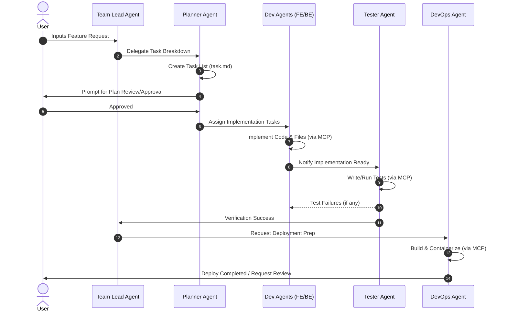

# Workflow & Collaboration Design

This document details the step-by-step collaborative execution pipeline of AutoDev AI from user request to production-ready output.

---

## 1. Lifecycle of a Task

---

## 2. Agent Interaction Protocols

### 2.1 Planning Phase
1. **Team Lead** receives the instruction, conducts initial codebase research, and delegates to the **Planner**.
2. **Planner** writes a structured implementation plan and outputs a list of required files/actions.
3. The plan is held in state until the user approves or edits.

### 2.2 Execution Phase
1. Once approved, the task list is created inside the database state.
2. The orchestrator spawns the **Backend Agent** or **Frontend Agent** based on file targets.
3. Dev agents execute write and modify operations using filesystems and MCP-enabled tools.

### 2.3 Verification Phase
1. The **Tester Agent** executes tests against the generated code.
2. If tests fail, the tester sends feedback back to the respective dev agent's workspace.
3. If they pass, the changes are committed to a feature branch.

### 2.4 DevOps & Deployment Phase
1. The **DevOps Agent** reviews system files, configuration settings, and updates the Docker setups or CI workflows.
2. Once the build is verified, it outputs deployment logs and marks the task as complete.
